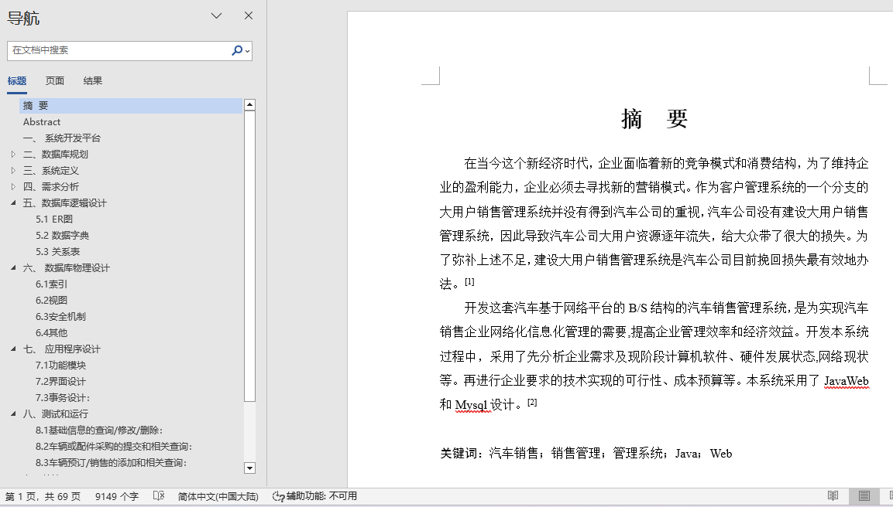
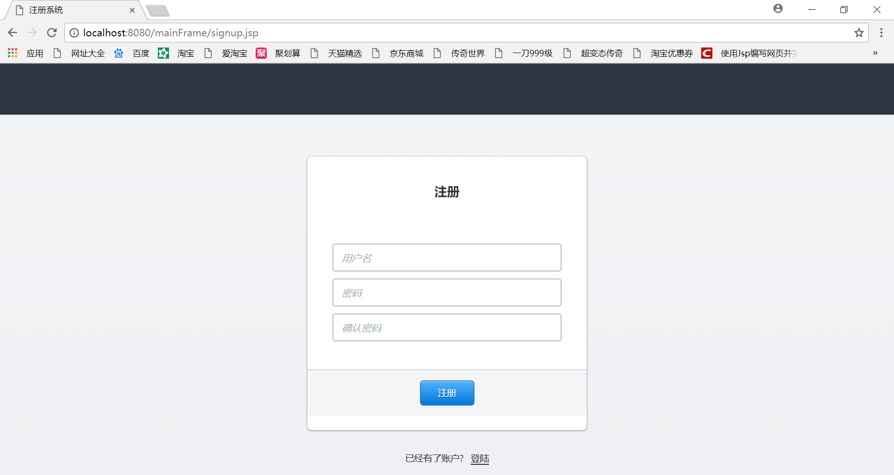
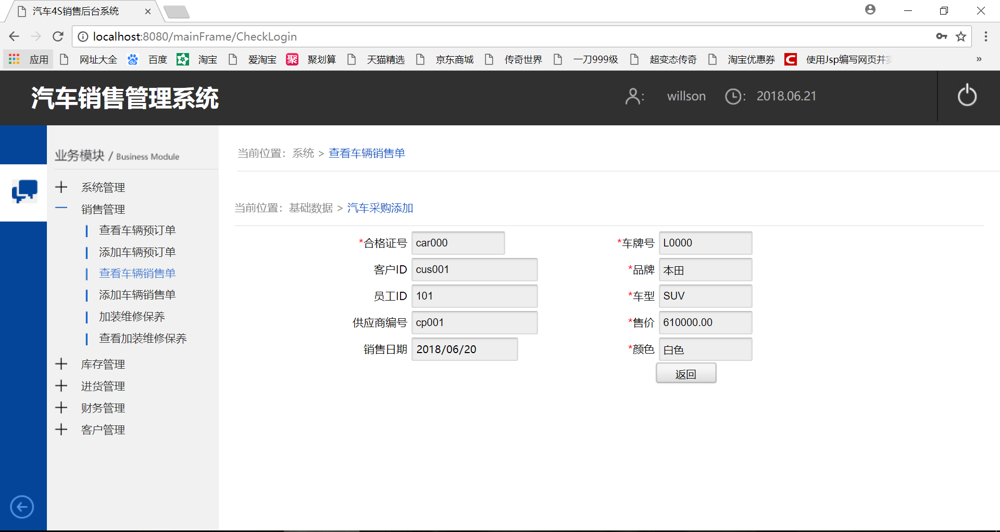
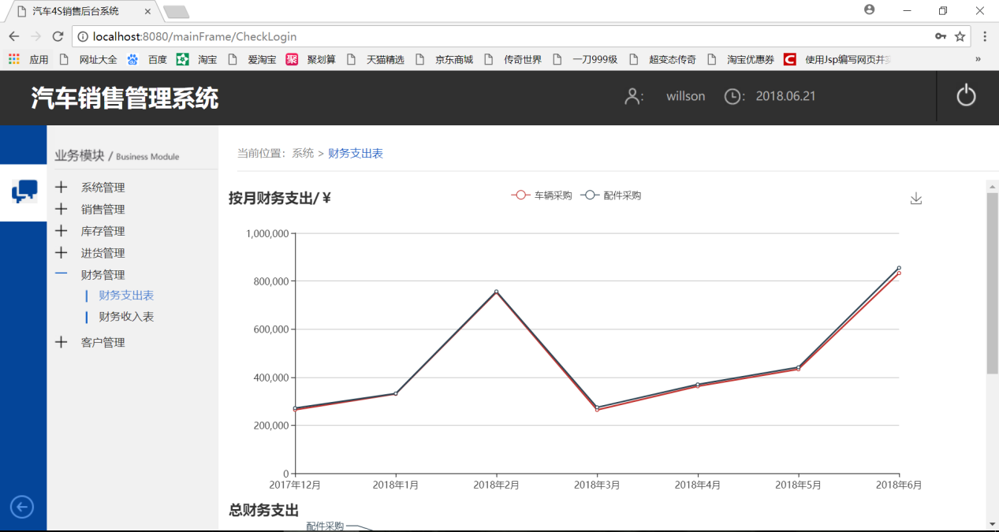
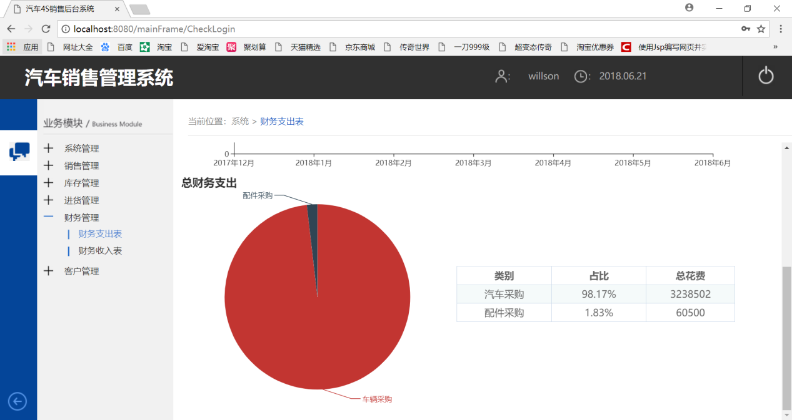
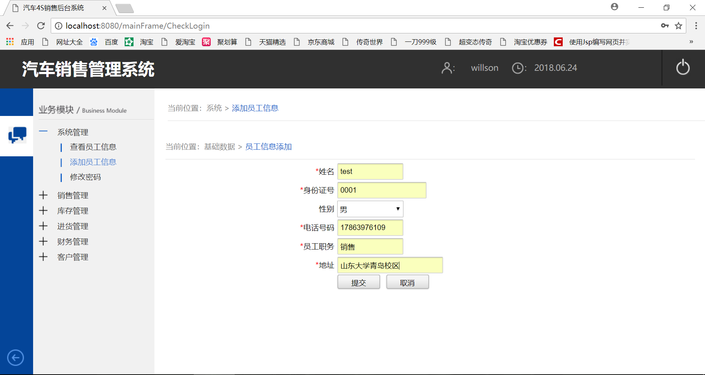
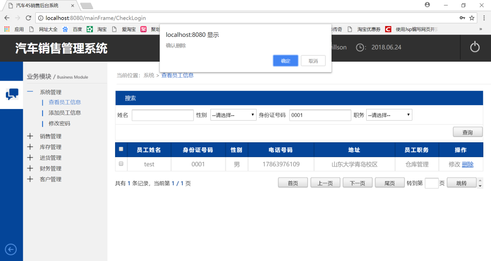
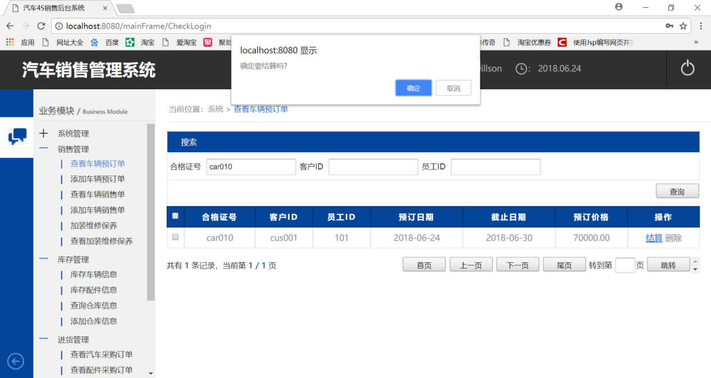

## 基于JSP+Servlet实现的汽车管理系统(程序+报告)

- <b>完整代码获取地址：从戎源码网 ([https://armycodes.com/](https://armycodes.com/))</b>
- <b>技术探讨、资料分享，请加QQ群：692619798</b> 
- <b>作者微信：19941326836  QQ：952045282</b> 
- <b>承接计算机毕业设计、Java毕业设计、Python毕业设计、深度学习、机器学习</b>
- <b>选题+开题报告+任务书+程序定制+安装调试+论文+答辩ppt 一条龙服务</b>
- <b>所有选题地址 ([https://github.com/YuLin-Coder/AllProjectCatalog](https://github.com/YuLin-Coder/AllProjectCatalog)) </b>

## 项目介绍
基于JSP+Servlet实现的汽车管理系统，主要功能如下

【业务模块】
系统管理：查看员工信息，添加员工信息，修改密码

销售管理：查看车辆预订单，添加车辆预订单，查看车辆销售单，添加车辆销售单，加装维修保养，查看加装维修保养

库存管理：库存车辆信息，库存配件信息，查询仓库信息，添加仓库信息

进货管理：查看汽车采购订单，查看配件采购订单，添加汽车采购订单，添加采购配件订单，查看供货商信息，添加供货商信息

财务管理：财务支出表，财务收入表

客户管理：查看客户信息：添加客户信息

## 项目技术
- 编程语言：Java
- 数据库：MySQL
- 前端技术：JSP、JavaScript、bootstrap、JQuery
- 后端技术：Servlet、JDBC

## 运行环境
- JDK版本：JDK1.8及以上
- 开发工具：IDEA、Ecplise、Myecplise都可以
- 数据库: MySQL5.7及以上

## 运行截图

